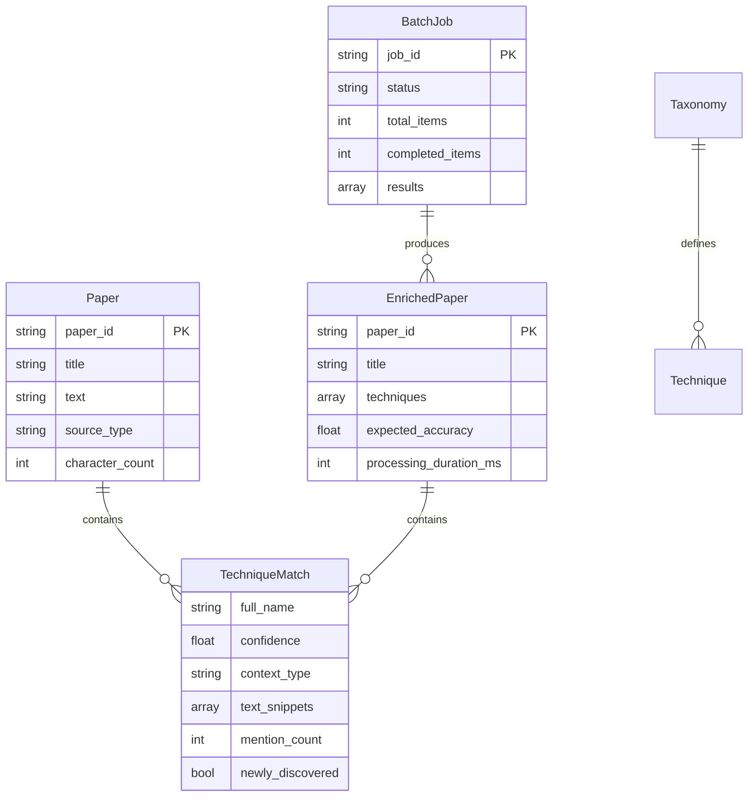

# Data Model: AI Technique Extraction Service

**Feature**: 001-technique-extraction | **Date**: 2025-11-05 | **Status**: Complete

## Purpose

Defines all entities, their fields, validation rules, and relationships for the AI Technique Extraction Service.

---

## Entity Overview



---

## 1. Paper (Input Entity)

**Purpose**: Represents raw content submitted for technique extraction

**Fields**:

| Field | Type | Required | Validation | Example |
|-------|------|----------|------------|---------|
| `paper_id` | string | Yes | UUID or slug, 1-100 chars | `"arxiv-2023-12345"` |
| `title` | string | No | 1-500 chars | `"Attention Is All You Need"` |
| `text` | string | Yes | 100-500,000 chars | `"We propose a new architecture..."` |
| `source_type` | enum | Yes | academic/blog/press_release/podcast/social | `"academic"` |
| `character_count` | int | Computed | Auto-calculated from `text` | `45123` |

**Validation Rules**:
- `text` MUST be 100-500,000 characters (reject too short/long)
- `text` MUST be English (fasttext ≥0.8 confidence)
- `text` MUST NOT be >30% non-English by word count (code-switching detection)
- `source_type` determines preprocessing strategy and confidence multiplier

**Pydantic Model**:
```python
from pydantic import BaseModel, Field, validator
from enum import Enum

class SourceType(str, Enum):
    ACADEMIC = "academic"
    BLOG = "blog"
    PRESS_RELEASE = "press_release"
    PODCAST = "podcast"
    SOCIAL = "social"

class Paper(BaseModel):
    paper_id: str = Field(..., min_length=1, max_length=100, 
                          description="Unique identifier for the paper",
                          example="arxiv-2023-12345")
    title: str | None = Field(None, max_length=500, 
                               description="Paper title (optional)",
                               example="Attention Is All You Need")
    text: str = Field(..., min_length=100, max_length=500000,
                      description="Full text content for extraction",
                      example="We propose a new architecture...")
    source_type: SourceType = Field(..., description="Content source type for preprocessing")
    
    @validator('text')
    def validate_english(cls, v):
        # Language detection implemented in service layer
        return v
    
    @property
    def character_count(self) -> int:
        return len(self.text)
```

---

## 2. TechniqueMatch (Extracted Technique)

**Purpose**: Represents a single AI technique identified in the content

**Fields**:

| Field | Type | Required | Validation | Example |
|-------|------|----------|------------|---------|
| `full_name` | string | Yes | From taxonomy, exact match | `"Retrieval-Augmented Generation"` |
| `confidence` | float | Yes | 0.0-1.0, rounded to 2 decimals | `0.87` |
| `context_type` | enum | Yes | production/research/tutorial/criticism/general | `"research"` |
| `text_snippets` | array | No | Up to 3 snippets, 50 chars each | `["...using RAG systems for...", ...]` |
| `mention_count` | int | Yes | ≥1, number of times mentioned | `5` |
| `newly_discovered` | bool | Yes | true if not in taxonomy | `false` |
| `low_confidence` | bool | Computed | true if confidence <0.6 | `false` |

**Context Type Detection** (FR-014):
- **production**: Keywords like "production", "deployed", "live", "released"
- **research**: Keywords like "study", "experiment", "investigate", "paper"
- **tutorial**: Keywords like "tutorial", "guide", "how-to", "example"
- **criticism**: Keywords like "failed", "problem", "issue", "limitation"
- **general**: Fallback if no keywords match

**Validation Rules**:
- `full_name` MUST match taxonomy entry (case-insensitive after normalization)
- `confidence` MUST be result of formula: `base × source_multiplier × frequency_boost`
- `text_snippets` array MAX 3 items, each snippet 50 chars (±25 chars around keyword)
- `mention_count` increments frequency_boost: 1=1.0x, 2-4=1.1x, 5+=1.2x

**Pydantic Model**:
```python
from pydantic import BaseModel, Field
from enum import Enum

class ContextType(str, Enum):
    PRODUCTION = "production"
    RESEARCH = "research"
    TUTORIAL = "tutorial"
    CRITICISM = "criticism"
    GENERAL = "general"

class TextSnippet(BaseModel):
    text: str = Field(..., max_length=50, description="50-char context window")
    char_offset: int = Field(..., description="Character offset in original text")

class TechniqueMatch(BaseModel):
    full_name: str = Field(..., description="Standardized technique name from taxonomy",
                           example="Retrieval-Augmented Generation")
    confidence: float = Field(..., ge=0.0, le=1.0, description="Confidence score 0-1",
                              example=0.87)
    context_type: ContextType = Field(..., description="Usage context classification")
    text_snippets: list[TextSnippet] = Field(default_factory=list, max_items=3,
                                              description="Up to 3 context windows")
    mention_count: int = Field(..., ge=1, description="Number of times mentioned",
                                example=5)
    newly_discovered: bool = Field(False, description="True if not in taxonomy")
    
    @property
    def low_confidence(self) -> bool:
        return self.confidence < 0.6
```

---

## 3. EnrichedPaper (Output Entity)

**Purpose**: Original paper enriched with extracted techniques and metadata

**Fields**:

| Field | Type | Required | Validation | Example |
|-------|------|----------|------------|---------|
| `paper_id` | string | Yes | Matches input Paper | `"arxiv-2023-12345"` |
| `title` | string | No | From input Paper | `"Attention Is All You Need"` |
| `techniques` | array | Yes | List of TechniqueMatch, may be empty | `[{...}, {...}]` |
| `expected_accuracy` | float | Computed | Based on source_type | `0.95` |
| `processing_duration_ms` | int | Computed | Time to process this paper | `8234` |
| `total_techniques_found` | int | Computed | `len(techniques)` | `3` |
| `confidence_distribution` | object | Computed | Min/max/avg confidence | `{"min":0.7, "avg":0.85, "max":1.0}` |

**Expected Accuracy by Source** (FR-018a):
- `academic`: 0.95
- `blog`: 0.90
- `press_release`: 0.85
- `podcast`: 0.80
- `social`: 0.70

**Validation Rules**:
- `techniques` MAY be empty array (no techniques found)
- `expected_accuracy` auto-calculated, NOT user-provided
- `processing_duration_ms` measured from request start to response
- `confidence_distribution` includes only techniques with confidence ≥0.6

**Pydantic Model**:
```python
from pydantic import BaseModel, Field, computed_field

class ConfidenceDistribution(BaseModel):
    min: float = Field(..., ge=0.0, le=1.0)
    avg: float = Field(..., ge=0.0, le=1.0)
    max: float = Field(..., ge=0.0, le=1.0)

class EnrichedPaper(BaseModel):
    paper_id: str = Field(..., description="Unique identifier")
    title: str | None = Field(None, description="Paper title")
    techniques: list[TechniqueMatch] = Field(default_factory=list,
                                              description="Extracted techniques (may be empty)")
    expected_accuracy: float = Field(..., ge=0.0, le=1.0,
                                      description="Expected accuracy for this source type",
                                      example=0.95)
    processing_duration_ms: int = Field(..., ge=0, description="Processing time in milliseconds")
    
    @computed_field
    @property
    def total_techniques_found(self) -> int:
        return len(self.techniques)
    
    @computed_field
    @property
    def confidence_distribution(self) -> ConfidenceDistribution:
        if not self.techniques:
            return ConfidenceDistribution(min=0.0, avg=0.0, max=0.0)
        confidences = [t.confidence for t in self.techniques]
        return ConfidenceDistribution(
            min=min(confidences),
            avg=sum(confidences) / len(confidences),
            max=max(confidences)
        )
```

---

## 4. BatchJob (Async Job Tracking)

**Purpose**: Tracks status of async batch processing jobs

**Fields**:

| Field | Type | Required | Validation | Example |
|-------|------|----------|------------|---------|
| `job_id` | string | Yes | UUID v4 | `"550e8400-e29b-41d4-a716-446655440000"` |
| `status` | enum | Yes | pending/processing/completed/failed | `"processing"` |
| `total_items` | int | Yes | Number of papers in batch | `100` |
| `completed_items` | int | Yes | Papers processed so far | `47` |
| `failed_items` | int | Computed | Papers that failed | `2` |
| `results` | array | Yes | List of EnrichedPaper (grows as processing continues) | `[{...}, {...}]` |
| `errors` | array | Yes | List of error messages for failed items | `[{"paper_id": "...", "error": "..."}]` |
| `created_at` | datetime | Yes | ISO 8601 timestamp | `"2025-11-05T14:30:00Z"` |
| `updated_at` | datetime | Yes | ISO 8601 timestamp | `"2025-11-05T14:32:15Z"` |

**State Transitions**:
```
pending → processing → completed
              ↓
            failed (if all items fail)
```

**Validation Rules**:
- `job_id` MUST be UUID v4 format
- `completed_items` + `failed_items` ≤ `total_items`
- `status=completed` when `completed_items + failed_items == total_items`
- `results` array grows incrementally (allows partial results polling)

**Pydantic Model**:
```python
from pydantic import BaseModel, Field
from enum import Enum
from datetime import datetime
from uuid import UUID

class JobStatus(str, Enum):
    PENDING = "pending"
    PROCESSING = "processing"
    COMPLETED = "completed"
    FAILED = "failed"

class JobError(BaseModel):
    paper_id: str
    error: str
    tier: int = Field(..., ge=1, le=3, description="Error tier (1=expected, 2=retriable, 3=non-retriable)")

class BatchJob(BaseModel):
    job_id: UUID = Field(..., description="Unique job identifier")
    status: JobStatus
    total_items: int = Field(..., ge=1, description="Total papers in batch")
    completed_items: int = Field(0, ge=0)
    results: list[EnrichedPaper] = Field(default_factory=list)
    errors: list[JobError] = Field(default_factory=list)
    created_at: datetime
    updated_at: datetime
    
    @property
    def failed_items(self) -> int:
        return len(self.errors)
    
    @property
    def progress_percent(self) -> float:
        return (self.completed_items + self.failed_items) / self.total_items * 100
```

---

## 5. Taxonomy (Configuration Entity)

**Purpose**: Canonical list of known AI techniques with aliases

**Structure** (JSON file: `src/data/taxonomy.json`):
```json
{
  "retrieval_augmented_generation": {
    "full_name": "Retrieval-Augmented Generation",
    "aliases": ["RAG", "retrieval augmented", "rag system", "retrieval-based generation"],
    "category": "Architecture Patterns",
    "confidence_boost": 0.0,
    "description": "Combines retrieval of relevant documents with generative models"
  },
  "reinforcement_learning_from_human_feedback": {
    "full_name": "Reinforcement Learning from Human Feedback",
    "aliases": ["RLHF", "rlhf training", "human feedback learning"],
    "category": "Training Methods",
    "confidence_boost": 0.0,
    "description": "Fine-tunes models using human preference feedback"
  }
}
```

**Fields per Technique**:
- `full_name`: Canonical name (title case)
- `aliases`: Array of synonyms and abbreviations (lowercase)
- `category`: Grouping for UI/filtering
- `confidence_boost`: Optional 0.0-0.1 boost for high-priority techniques
- `description`: Optional context for LLM validation

**Validation Rules**:
- Taxonomy loaded at startup, immutable during runtime
- All aliases normalized (lowercase, strip whitespace)
- No duplicate aliases across techniques
- Initial taxonomy: ~50 techniques (expandable)

**Loading in Service**:
```python
import json
from pathlib import Path

class TaxonomyLoader:
    def __init__(self, taxonomy_path: Path):
        with open(taxonomy_path) as f:
            self.taxonomy = json.load(f)
        self._build_alias_index()
    
    def _build_alias_index(self):
        """Build reverse index: alias → full_name"""
        self.alias_to_name = {}
        for key, tech in self.taxonomy.items():
            full_name = tech['full_name']
            # Map all aliases to full name
            for alias in tech['aliases']:
                normalized = alias.lower().strip()
                self.alias_to_name[normalized] = full_name
            # Also map full name to itself
            self.alias_to_name[full_name.lower()] = full_name
    
    def lookup(self, keyword: str) -> str | None:
        """Exact match lookup: keyword → full_name"""
        return self.alias_to_name.get(keyword.lower().strip())
```

---

## Relationships & Data Flow

### Extraction Pipeline Flow

```
1. Paper (input)
   ↓
2. Preprocessing (by source_type)
   ↓
3. Embedding (via embedding_client)
   ↓
4. Topic Clustering (BERTrend)
   ↓
5. Technique Mapping (taxonomy lookup + LLM)
   ↓
6. TechniqueMatch[] (with confidence, context, snippets)
   ↓
7. EnrichedPaper (output)
```

### Batch Processing Flow

```
1. POST /extract/techniques → BatchJob created (status=pending)
   ↓
2. Background task processes papers asynchronously
   ↓
3. GET /jobs/{job_id} polls status (status=processing)
   ↓
4. Results[] and errors[] arrays populate incrementally
   ↓
5. status=completed when all items processed
```

---

## Validation Summary

| Entity | Key Validations |
|--------|-----------------|
| Paper | 100-500K chars, English ≥0.8, valid source_type |
| TechniqueMatch | confidence 0-1, full_name in taxonomy, ≤3 snippets |
| EnrichedPaper | expected_accuracy auto-calculated, duration tracked |
| BatchJob | UUID job_id, status transitions, progress tracking |
| Taxonomy | No duplicate aliases, all lowercase normalized |

---

**Data Model Status**: ✅ Complete - All entities defined with Pydantic models  
**Next**: Generate contracts/openapi.yaml from these models

